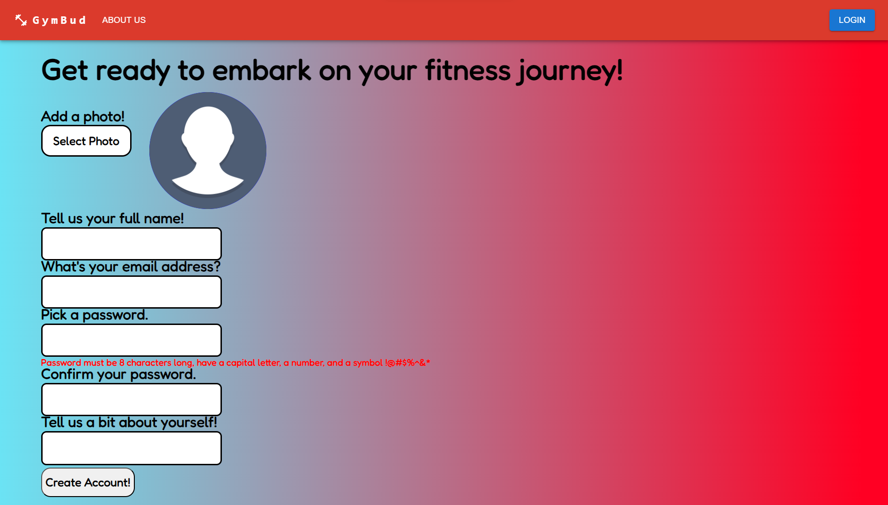
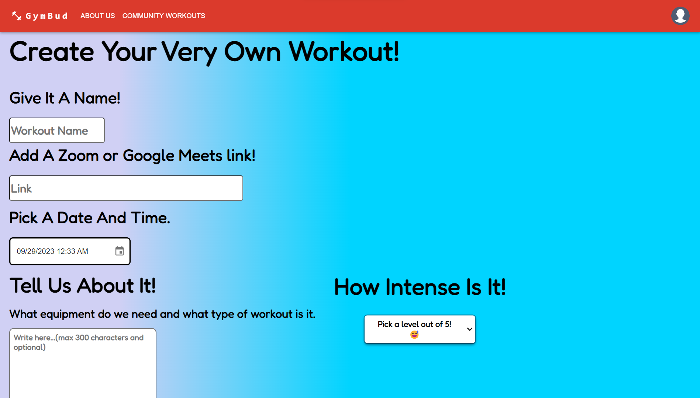
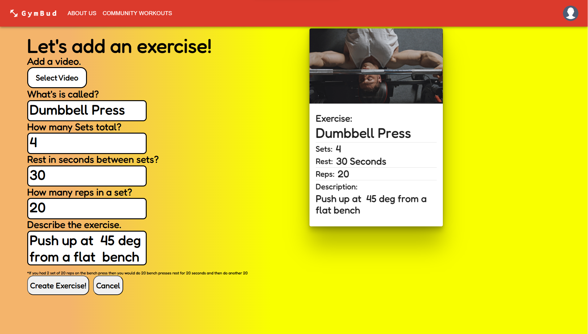
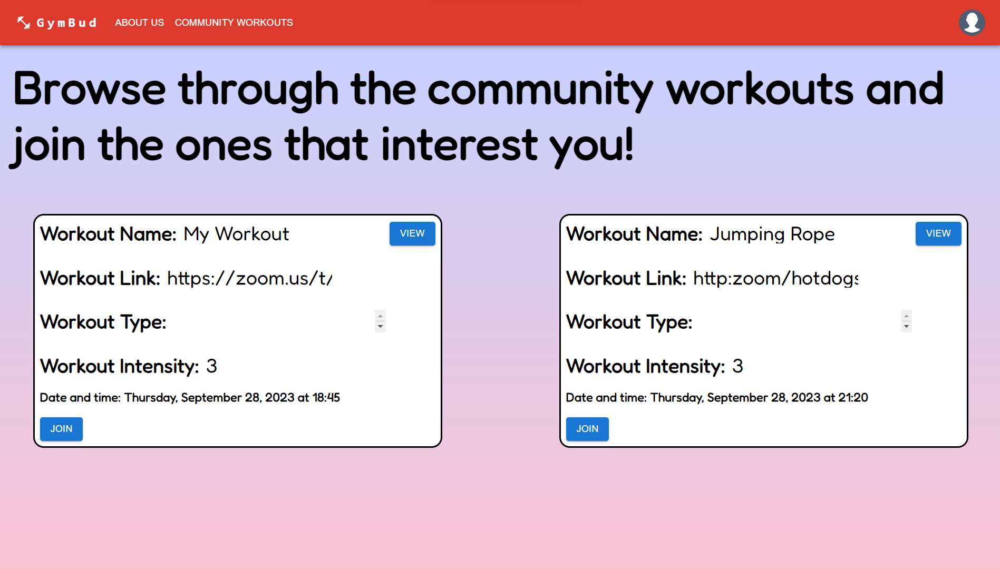
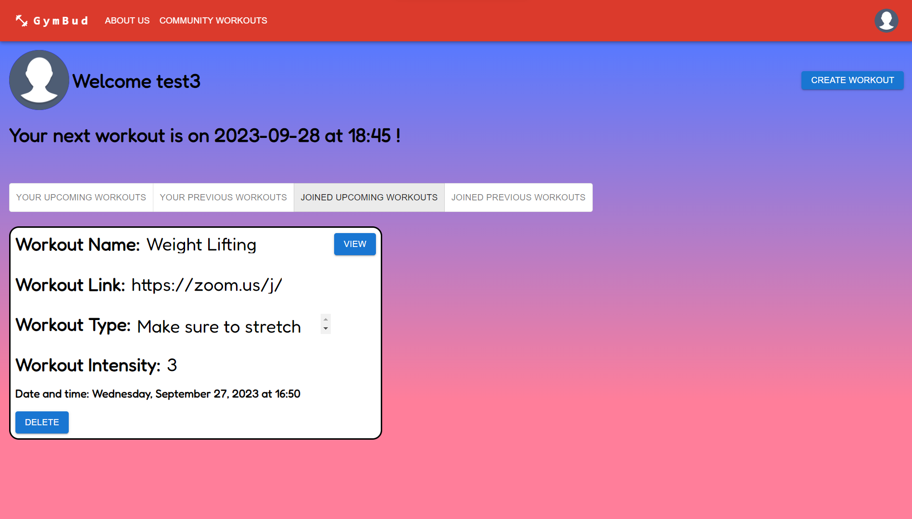
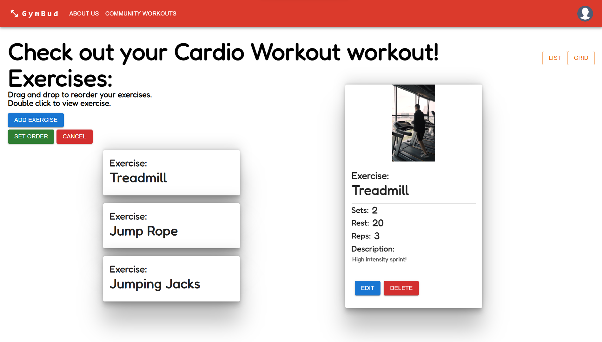

# GymBud

GymBud is a Rails React app that allows users to sign up and view workouts in the community, create their own workouts, and add exercises along with videos demonstrating the exercises. 

## Installation

```bash
bundle install
rails db:create db:migrate db:seed
sudo service cron start
npm install --prefix client
npm start --prefix client
```

## Usage

<div style="display: flex; justify-content: center;">
  <div style="flex: 1; margin: 10px;">
  Click on login to create an account
    
  </div>
  <div style="flex: 1; margin: 10px;">
  Create a workout
    
  </div>
</div>

<div style="display: flex; justify-content: center;">
  <div style="flex: 1; margin: 10px;">
  Add an exercise
    
  </div>
  <div style="flex: 1; margin: 10px;">
  Find workouts on the community page
    
  </div>
</div>

<div style="display: flex; justify-content: center;">
  <div style="flex: 1; margin: 10px;">
  View your workouts on your user page
    
  </div>
  <div style="flex: 1; margin: 10px;">
  Reorder the exercises on your workouts
    
  </div>
</div>


```


## Technologies and Packages Used

This project utilizes a variety of technologies and packages to achieve its functionality:

- **React** - A JavaScript library for building user interfaces.
- **Ruby on Rails** - A web application framework for building robust web applications.
- **Active Storage** - A Rails library for managing and serving files.
- **Whenever** - A Ruby gem for managing cron jobs. It allows for easy scheduling of recurring tasks within your Rails application.
- **AWS S3 Storage** - Amazon Web Services (AWS) Simple Storage Service for file storage.
- **react-grid-dnd** - A React component for draggable and droppable grid layouts.
- **Framer Motion** - A React animation library for creating smooth animations.
- **Material-UI (MUI)** - A popular React UI framework that provides pre-designed components.

Feel free to explore the documentation and resources associated with each technology or package to learn more about how they were used in this project.


## license 

[MIT](https://choosealicense.com/licenses/mit/)